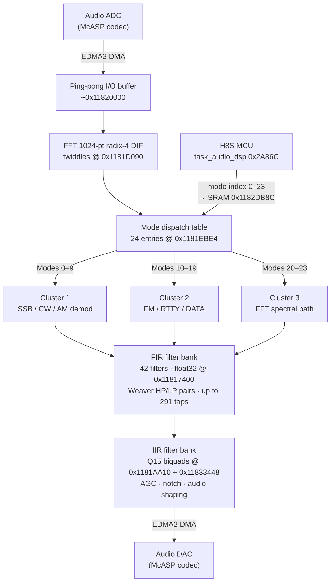
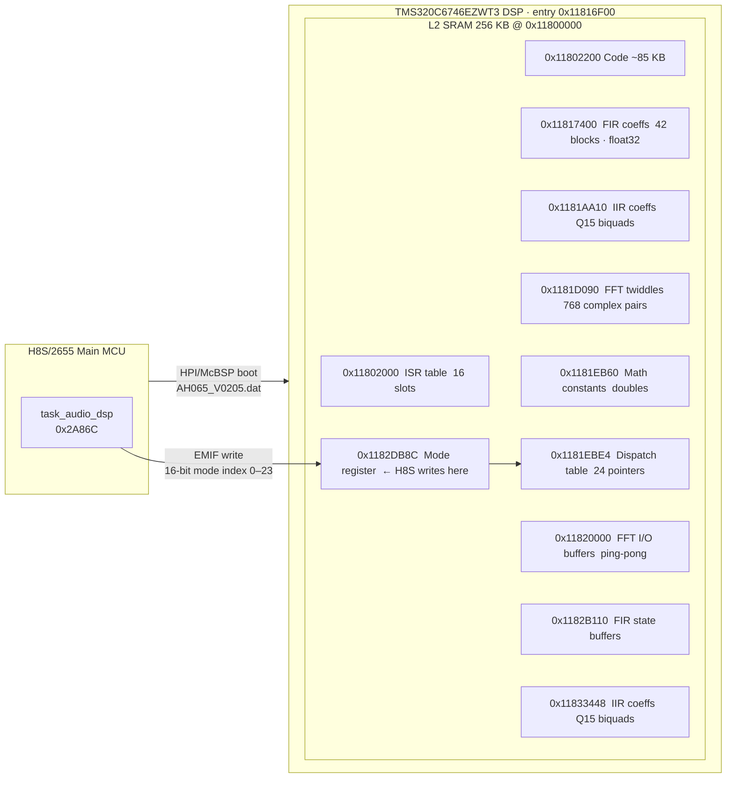

# FT-891 DSP Firmware Analysis

## Overview

**File:** `AH065_V0205.dat`  
**Size:** 124,260 bytes (0x1E564)  
**Checksum (Yaesu header):** 0x00A65595  
**Target:** TMS320C6746EZWT3 DSP (C674x core)  
**Architecture:** VLIW, C64x+ fixed-point + C67x+ IEEE floating-point, little-endian, 32-bit  

---

## File Format

The `.dat` file uses a Yaesu-specific wrapper around the TI Boot Table (RBL) format:

```
Offset  Size  Description
0x0000     4  File size (0x0001E564 = 124,260)
0x0004     4  Yaesu checksum (0x00A65595)
0x0008     4  DSP entry point address (0x11816F00)
0x000C     -  TI Boot Table: [{size,load_addr,data...}...][0x00000000]
```

The TI Boot Table format is the standard secondary bootloader (SBL) protocol: a sequence of `[size][load_addr][raw data]` records terminated by a 0-size record.

The H8S main board MCU loads this file and transmits it to the C6746 DSP via the HPI (Host Port Interface) or McBSP boot interface, then releases the DSP reset.

---

## Memory Map (L2 SRAM)

All 8 loaded sections reside in the C6746 L2 SRAM at 0x11800000 (256KB).

```
Address       Section  Size      Purpose
-----------   -------  --------  -----------------------------------------
0x11800020    (HPI)    -         Reset/boot vector (set by H8S, not in image)
0x11802000    [0]      512 B     ISR dispatch table (16 x 32-byte handler stubs)
0x11802200    [1]      85,504 B  Main DSP code (~85 KB)
0x11817400    [5]      13,836 B  FIR filter coefficient table (float32)
0x1181AA10    [6]      9,856 B   IIR filter coefficients (Q15 biquad)
0x1181D090    [2]      6,856 B   FFT twiddle factors (float32 complex pairs)
0x1181EB60    [3]      132 B     Math constants (double64 powers-of-2, log tables)
0x1181EBE4    [4]      96 B      Mode dispatch table (24 x 4-byte function pointers)
0x11833448    [7]      6,364 B   Additional Q15 IIR filter coefficients
0x11835D24    (stack)  -         Stack top (grows downward)
0x11835D28    (DP)     -         Data page pointer base (B14 = global variables)
```

Total loaded code+data: ~124 KB of 256 KB L2 SRAM.

---

## ISR Dispatch Table (Section 0, 0x11802000)

The C6000 IST (Interrupt Service Table) requires exactly 16 x 32-byte (8-instruction fetch packet) slots for INT0-INT15.

```
Slot  Address     Handler
----  ----------  -----------------------------------------------
INT0  0x11802000  B.S2 0x11800020 (branch to H8S-configured reset handler)
INT1  0x11802020  SELF-LOOP (unhandled NMI)
INT2  0x11802040  SELF-LOOP
INT3  0x11802060  SELF-LOOP
INT4  0x11802080  SELF-LOOP
...   ...         SELF-LOOP (all INT4-INT15 default to self-loop)
INT15 0x118021E0  SELF-LOOP
```

The self-loop pattern is the standard "unhandled interrupt" default. INT0 (RESET) branches to 0x11800020, which is the address the H8S configures after loading the DSP program.

---

## Startup Sequence

**Entry point: 0x11816F00**

```
11816F00   MVK.S2  0x5D24, B15        ; SP lower 16 bits
11816F04   MVKH.S2 0x11830000, B15    ; SP = 0x11835D24 (stack top)
           [C674x FP insn]             ; AND B15 to 8-byte align
11816F0C   MVK.S2  0x5D28, B14        ; DP lower 16 bits
11816F10   MVKH.S2 0x11830000, B14    ; DP = 0x11835D28 (data page pointer)
11816F14   [C674x FP insn]             ; ZERO B4
11816F18   MVC.S2  B4, FADCR           ; clear FP addition control register
11816F1C   MVC.S2  B4, FMCR            ; clear FP multiply control register
11816F20   MVK.S2  0x64E0, B4
11816F24   MVKH.S2 0x11810000, B4      ; B4 = 0x118164E0 (main init function)
11816F28   B.S2    B4                  ; jump to 0x118164E0
  [5 delay slots: set A4=0x11817400 (FIR table), A3=0x11817100]
```

**C6000 ABI registers after startup:**
- `B15` = 0x11835D24 (stack pointer, grows down)
- `B14` = 0x11835D28 (data page pointer, base for B14-relative globals)
- `A4`  = 0x11817400 (FIR coefficient table base, passed to init)
- `A3`  = 0x11817100 (secondary data pointer, passed to init)
- `FADCR/FMCR` = 0 (default FP rounding mode: round-to-nearest)

**Main init function: 0x118164E0**

First instruction: `CMPEQ.L1 -1, A4, A0` validates the FIR table pointer (checks != NULL = 0xFFFFFFFF). After initialization, branches to 0x11816C20 (DSP processing loop setup).

---

## Code Structure (Section 1, 0x11802200-0x118173FF)

### Function Count

Analysis of the 85 KB code section via `dis6x --silicon_version=6740`:
- **90 function returns** (`B.S2 B3` / `BNOP.S2 B3`)
- **10 non-leaf functions** (save B3 to stack: `STW.D2T2 B3,*B15--[N]`)
- **~80 leaf functions** (no nested calls)

Note: The C674x FP instruction set uses a "fetch packet header" word (`.fphead`) followed by packed 16-bit sub-instructions. Many appear as `.word` entries in dis6x output (not decoded).

### Key Functions

| Address     | Role                                          |
|-------------|-----------------------------------------------|
| 0x11816F00  | **Entry point** — startup (SP/DP/FP init)    |
| 0x118164E0  | **Main init** — validates FIR table, enters loop |
| 0x11816C20  | **DSP loop setup** — configures audio pipeline |
| 0x11816588  | Init: function-pointer table dispatch loop    |
| 0x118169C0  | Init: function-pointer table dispatch loop    |
| 0x11816A68  | Init: function-pointer table dispatch loop    |
| 0x11810660  | **Main audio loop top** (re-entry point)      |
| 0x1181416C  | **Main audio loop bottom** (`[!B0] B 0x11810660`) |
| 0x118141E0  | **Error/exit handler** (reached when B0 ≠ 0) |
| 0x11803800  | **Mode dispatch** — reads 0x1182DB8C, jumps to cluster 1 |
| 0x1180CFF4  | Non-leaf (10-slot stack frame)                |
| 0x1180F868  | Non-leaf (10-slot stack frame)                |
| 0x1181066C  | Non-leaf (4-slot stack frame, inside main loop) |
| 0x11817200  | Non-leaf (2-slot stack frame)                 |
| 0x118173A0  | Non-leaf (4-slot stack frame)                 |
| 0x118173C0  | Non-leaf (2-slot stack frame)                 |

### Main Audio Loop

The DSP runs a single continuous audio processing loop:

```
; Pre-loop stack adjustment (one-time, ~0x11810654):
118105F0:  ADDK.S2  392, B15           ; reserve 392-byte frame on stack

; Loop top — re-entered every audio frame:
11810660:  [...]                        ; B0 = 0 = continue flag

; Non-leaf prologue inside loop body:
1181066C:  STW.D2T2 B3,*B15--[4]       ; push return addr, 16-byte sub-frame

; ... ~15 KB of audio processing (FFT, filter calls, mode dispatch) ...

; Loop bottom:
1181416C:  [!B0] B.S2  0x11810660      ; if B0==0: repeat (normal path)
           [B0]  B.S2  0x118141E0      ; if B0!=0: exit to error handler
```

B0 is an "exit flag" — normally 0, set to non-zero on shutdown or error. The loop body spans
0x11810660–0x1181416C (~15 KB, ~3,900 instructions), encompassing the full audio pipeline
for one audio frame.

### Initialization-Time Poll Loops

Three tight loops in the startup code (0x11816588, 0x118169C0, 0x11816A68) share the pattern:

```
top:  LDW.D2T2  *++B10[1], B0     ; load next function pointer from table
      NOP 4
      [B0]  B.S1  top              ; if B0!=0: loop (→ call it too)
      [B0]  B.S2  B0               ; indirect call via B0 (overrides the loop branch)
                                   ; if B0==0: fall through = exit loop
```

This is a **function-pointer table walker**: it iterates over a null-terminated table of
function pointers, calling each one in sequence. Used during init to run a list of
hardware setup callbacks (codec init, DMA config, etc.).

---

## Mode Dispatch Table (Section 4, 0x1181EBE4)

24 function pointers that select mode-specific DSP processing.

**Cluster 1 — Demodulation modes A (entries 0-9, ~0x1180384C-0x118039AC):**

7 unique functions used across 10 slots. Functions perform complex quadrature
demodulation, likely for SSB (USB/LSB), CW, and AM modes. The code around
0x11803828 reads a lookup table (indexed by a mode parameter) and dispatches
based on the result.

| Entry | Target      |
|-------|-------------|
| [0]   | 0x118039AC  |
| [1]   | 0x11803984  |
| [2]   | 0x118038AC  |
| [3]   | 0x11803880  |
| [4]   | 0x1180384C  |
| [5]   | 0x11803932  |
| [6]   | 0x118038D6  |
| [7]   | 0x118038AC  (= [2]) |
| [8]   | 0x11803880  (= [3]) |
| [9]   | 0x1180384C  (= [4]) |

**Cluster 2 — Demodulation modes B (entries 10-19, ~0x1180AD36-0x1180AE60):**

Entries 10-14 are single-instruction stubs: `BNOP.S2X A8, 5` (branch-through-A8).
The actual handler address is passed in A8 at call time, enabling a second level
of runtime dispatch. Likely used for FM/RTTY/DATA modes where the processing path
varies more significantly.

| Entry | Target      | Notes                    |
|-------|-------------|--------------------------|
| [10]  | 0x1180AD4C  | BNOP-A8 stub, = [14]     |
| [11]  | 0x1180AD48  | BNOP-A8 stub             |
| [12]  | 0x1180AD40  | BNOP-A8 stub             |
| [13]  | 0x1180AD36  | BNOP-A8 stub             |
| [14]  | 0x1180AD4C  | BNOP-A8 stub, = [10]     |
| [15]  | 0x1180AE60  | = [17]                   |
| [16]  | 0x1180AE5A  |                          |
| [17]  | 0x1180AE60  |                          |
| [18]  | 0x1180ADE4  |                          |
| [19]  | 0x1180ADF6  |                          |

**Cluster 3 — FFT/spectral processing (entries 20-23, ~0x118072F8-0x118074D4):**

Functions access L2 SRAM at 0x11820000 range (FFT I/O buffers). Likely implements
frequency-domain processing paths (e.g., noise reduction or interference cancellation).

| Entry | Target      |
|-------|-------------|
| [20]  | 0x118074D4  |
| [21]  | 0x118073AC  |
| [22]  | 0x11807344  |
| [23]  | 0x118072F8  |

---

## Signal Processing Chain

### Overview



### FFT Block

- **Size:** 1024-point complex FFT
- **Algorithm:** Radix-4 DIF (Decimation-In-Frequency), TI DSPLIB `DSPF_sp_cfft_cn` format
- **Twiddle table:** 768 complex float32 pairs @ 0x1181D090 (= 3N/4 for N=1024)
- **Pattern:** Standard bit-reversed angle ordering: 0°, 90°, 45°, 135°, 22.5°, 112.5°...
- **I/O buffers:** Located at ~0x11820000 in L2 SRAM (128 KB offset)
- **Purpose:** Frequency-domain conversion for spectral filtering and demodulation

### FIR Filter Bank (Section 5, 0x11817400)

42 FIR filter blocks, each stored as: `[n_taps*4][out_buf_addr][float32 coeff × n_taps]`, separated by 4-byte zero padding.

| Class      | Taps | Count | Typical purpose                              |
|-----------|------|-------|----------------------------------------------|
| Wide A/B  | 291  | 2     | Main IF filter ~2.4 kHz (SSB mode)          |
| Medium A/B| 189  | 2     | Medium IF bandwidth                          |
| Narrow A/B| 101  | 2     | CW/narrow IF filter                          |
| Narrowest | 91   | 1     | Narrowest IF passband                        |
| Audio     | 14-48| 12    | Audio EQ, noise reduction, notch             |
| Micro     | 2-18 | 23    | Interpolation/decimation, de-emphasis        |

**Filter characteristics:**
Filters come in HP/LP complementary pairs (one with DC gain ≈ 0, the other ≈ 1), used for I/Q separation in the Weaver (phasing) method of SSB demodulation. Example:

- Filter 0 @ 0x11817400: 291-tap HP (DC gain=0.0006, Nyq=0.9995), state buf → 0x1182B110
- Filter 1 @ 0x11817898: 291-tap LP (DC gain=1.0006, Nyq=0.0005), state buf → 0x1182B5A0

Filter state buffers are allocated sequentially in L2 SRAM from 0x1182B110 upward.

**Post-filter config table (Section 5, offset 8328, address 0x11819488):**

After the 42 filter coefficient blocks, section 5 contains a filter-group descriptor table:

```
[0x11819488]: 0x00000006   ← group count = 6
[0x1181948C]: 0x1182DB68   ← primary output buffer
[0x11819490]: 0x00070007   ← packed parameters (high 16 = 7, low 16 = 7)
[0x11819494]: 0x00000009   ← sub-count
[0x11819498]: 0x0000000C   ← sub-count
[0x1181949C]: 0x1182DB70   ← buffer 2
[0x118194A0]: 0x1182DA30   ← = filter[36] output buffer
[0x118194A4]: 0x1182DA90   ← = filter[38] output buffer
[0x118194A8]: 0x1182DAF0   ← = filter[40] output buffer
[0x118194AC]: 0x00000000   ← null (group terminator)
; more groups follow...
```

This is a multi-stage filter GROUP table: each group links the output buffers of related
filter stages (the even-numbered LP/HP pairs from the Weaver method) into a combined
output. The buffers cross-reference filter[36], [38], [40] outputs, which are the final
stages in the Weaver SSB filter chain.

### IIR Filter Bank (Sections 6 and 7)

Q15 signed 16-bit biquad (second-order section) coefficients:

| Section | Address     | Size       | Words   |
|---------|-------------|------------|---------|
| 6       | 0x1181AA10  | 9,856 B    | 4,928   |
| 7       | 0x11833448  | 6,364 B    | 3,182   |

Used for: audio shaping (de-emphasis, shelving EQ), AGC smoothing, and notch filters in cascaded biquad form.

### Math Constants (Section 3, 0x1181EB60)

64-bit double-precision floating-point constants:

| Offset | Value          | Identity             | Use                        |
|--------|----------------|----------------------|----------------------------|
| +0     | 1.0            | 2^0                  | Unity gain reference       |
| +8     | 1.189207115    | 2^(1/4) = 4th-rt(2)  | 3 dB gain step             |
| +16    | 1.414213562    | 2^(1/2) = sqrt(2)    | 6 dB gain step             |
| +24    | 1.681792831    | 2^(3/4)              | 9 dB gain step             |
| +32    | 1.044273782    | 2^(1/16)             | Fine gain step (0.375 dB)  |
| +40    | 1.090507733    | 2^(1/8)              | 1.5 dB gain step           |
| +48    | 1.138788635    | 2^(3/16)             | 2.25 dB gain step          |
| +56    | 3.05176e-05    | 2^(-15)              | Q15 normalization factor   |
| +76    | 0.693147...    | ln(2)                | dB calculation             |
| +88    | 2.302585...    | ln(10)               | dB calculation             |

Powers-of-2 in fine fractional steps enable sub-dB AGC gain adjustment. ln(2) and ln(10) support dB-to-linear and S-meter calculations.

---

## Host-DSP Communication

The H8S main board (R5F61653 = H8S/2655) interacts with the C6746 DSP:

1. **Boot loading:** H8S transmits AH065_V0205.dat over HPI or McBSP boot interface, releases DSP RESET; C6746 RBL loads sections and branches to entry 0x11816F00.

2. **Runtime control:** Shared L2 SRAM — H8S has external bus access via EMIF to C6746's L2 SRAM. `task_audio_dsp @ 0x2A86C` in the H8S firmware manages the runtime communication.

3. **Mode register:** H8S writes a 16-bit mode index to **L2 SRAM address 0x1182DB8C**. The DSP reads it on every audio frame (or at mode-switch time) and dispatches to the matching entry in the 24-entry table at 0x1181EBE4.

   Exact DSP dispatch code at 0x11803800:
   ```
   118037F0:  MVK.S2   0xffffdb8c, B10   ; B10[15:0] = 0xDB8C
   11803800:  MVKH.S2  0x11820000, B10   ; B10 = 0x1182DB8C  ← H8S writes mode here
   11803808:  LDHU.D2T2 *+B10[0], B3     ; B3 = mode_index (unsigned 16-bit)
   1180382C:  CMPLTU.L2 0x9, B3, B1     ; B1 = (B3 > 9)
   11803828:  MVK.S2   0xffffebe4, B5    ; B5[15:0] = 0xEBE4
   11803830:  MVKH.S2  0x11810000, B5   ; B5 = 0x1181EBE4  ← dispatch table
   11803834:  [B1]  B.S1  0x118039D8    ; mode > 9: jump to cluster 2/3 handler
   11803840:  [!B1] LDW.D2T2 *+B5[B4], B1 ; B1 = dispatch_table[mode_index]
   ; (C674x FP insns execute indirect branch to B1)
   ```

   Modes 0–9: dispatch from cluster 1 (SSB/CW/AM). Modes 10–23: second-level dispatch
   via A8 register (cluster 2 BNOP-A8 stubs) or cluster 3 (FFT spectral path).

---

## Block Diagram



---

## Toolchain

- **Disassembler:** TI `dis6x v7.3.4` from `github.com/superna9999/ti-cgt6x` at `/tmp/ti-cgt6x/`
  ```
  dis6x --silicon_version=6740 --all dsp_full.out > dsp_full_disasm.txt
  ```
- **COFF wrapper:** `$SCRATCHPAD/dsp_full.out` — TI COFF1, magic 0x0099, 8 sections, entry 0x11816F00
- **Full disassembly:** `$SCRATCHPAD/dsp_full_disasm.txt` — 36,069 lines
- **Ghidra:** No C6000/C674x support (only TI_MSP430)
- **radare2:** No C6000 support
- **capstone CS_ARCH_TMS320C64X:** Stops at first C674x FP instruction — not suitable
- **C674x note:** Floating-point instructions use a packed "fetch packet header" format; many appear as `.fphead`/`.word` in dis6x output (dis6x v7.3.4 does not fully decode them)

**Related files:**

| File                        | Description                           |
|-----------------------------|---------------------------------------|
| `AH065_V0205.dat`           | DSP firmware image (Yaesu boot table) |
| `AH065_M_V0110.bin`         | H8S main board MCU firmware           |
| `AH065_P_V0101.bin`         | H8S panel board MCU firmware          |
| `MAIN_FIRMWARE_ANALYSIS.md` | H8S main board firmware analysis      |
| `PANEL_FIRMWARE_ANALYSIS.md`| H8S panel board firmware analysis     |
| `$SCRATCHPAD/dsp_full.out`  | TI COFF1 wrapper for disassembler     |
| `$SCRATCHPAD/dsp_full_disasm.txt` | Full DSP firmware disassembly  |
