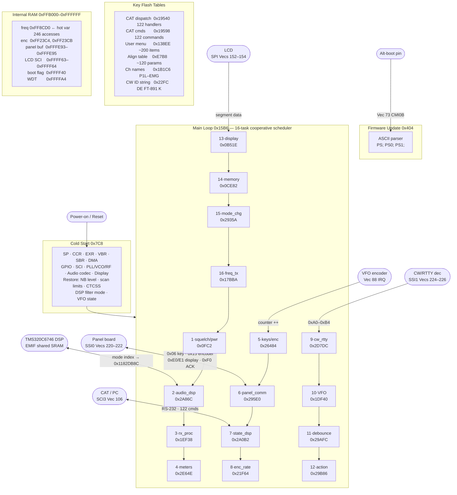

# FT-891 Firmware Analysis — AH065_M_V0110.bin

## Overview — Renesas H8S/2655 (R5F61653RN50FPV)

- **Architecture**: H8S/2600 series, 24-bit address space, **big-endian**, CISC-like with 16/32-bit instructions
- **Clock**: Unknown externally, but DMA init suggests ~10–20 MHz
- **Flash**: 384 KB at 0x000000–0x05FFFF (file offset = address directly)
- **Internal RAM**: ~32 KB at approx 0xFFB000–0xFFFFFF (stack initialized to 0xFFC000)
- **SFRs**: 0xFF2000–0xFF20FF (GPIO/SCI) and 0xFFFD00–0xFFFFFF (DMA, WDT, SYSCR)

---

## Memory Map

```
Address Range      Size    Content
─────────────────────────────────────────────────────────────────────
0x000000–0x0003FF  1 KB    Exception vector table (256 × 4-byte entries)
0x000400–0x000403  4 B     Default IRQ stub: BRA → 0x7C8 (soft reset on unhandled IRQ)
0x000404–0x0010CE  ~3 KB   FIRMWARE UPDATE / FACTORY BOOT MODE handler
0x0005F8–0x0007BD  ~500 B  Boot mode 2 (alternate hardware init path, joins main init)
0x0007BE–0x0007C7  10 B    CMIB1 handler: watchdog kick (writes 0xA500 to WDTCNT)
0x0007C8–0x001565  ~3.4 KB COLD START / Hardware initialization sequence
0x0015B6–0x0015F6  64 B    MAIN LOOP — 16-task round-robin scheduler
0x0015F7–0x05BFFF  ~376 KB Application code (tasks, subsystems, ISRs)
0x05C000–0x05FFFF  16 KB   Erased (0xFF fill)
```

---

## Boot Sequence (Cold Reset — vector 0 → 0x7C8)

```
0x7C8   ER7 (SP) ← 0x00FFC000          ; stack at top of internal RAM
0x7CE   CCR ← 0x80 (I=1)              ; disable all interrupts
0x7D0   EXR ← 0x7 (mask all ext IRQ)
0x7D4   VBR ← 0x000000                 ; vector table at flash base
0x7DC   SBR ← 0xFFFFFF00               ; SFR base address
0x7E4   DMA control init:
          WDTCNT/DMA @ 0xFFFDC2 ← 0xD102
          0xFFFF32 ← 0x20
          0xFFFDC4 ← 0x0010
          0xFFFDC6 ← 0xC8
0x808   GPIO PORT2000: clear bits 7,4,3,2  (output/enable lines)
0x828   JSR 0x09E4                      ; clock/PLL init (SYSCR, bus config)
0x82C   GPIO PORT2000: clear bits 5,6
0x834   JSR 0x0B86                      ; peripheral init (SCI, Timer, ADC)
0x840   EXR ← 0 (unmask interrupts)
0x844   BTST bit2, @0xFFFF40            ; check boot-mode flag (EEPROM/config)
        BEQ → 0x10DC (alternative boot path)
0x850   BTST bit7, @0xFF2000            ; check hardware mode pin
        BNE → 0x860
0x85A   JSR 0x0928                      ; startup path A (normal power-up)
0x860   JSR 0x096C                      ; startup path B (power-up from standby?)
...
0x894   JSR 0x2834E                     ; PLL/VCO init subsystem 1
0x898   JSR 0x28366                     ; PLL/VCO init subsystem 2
0x89C   JSR 0x28416                     ; RF frontend init
0x8A0   JSR 0x284E8                     ; RF frontend init 2
0x8A4   JSR 0x27F3E                     ; GPIO/SCI init: set port 0xFFFF59 bits 3,4; bit-bang 3×0x00 to PA/band-decoder IC via 0x292EE
0x8B0   JSR 0x2B1CE                     ; audio codec / DSP chain init
0x8B4   JSR 0x2B05C                     ; audio path init
0x8B8   JSR 0x2AB68                     ; audio output init
0x8C4   JSR 0x01366                     ; display system init
0x8D0   JSR 0x2C7A6                     ; SPI encoder interface init (clears counters)
0x8F4   JSR 0x2F058                     ; SCI4 enable: set MPBT (bit 0) of SSR4 @ 0xFFFBA4
0x8F8   JSR 0x03656                     ; scan limit init: load saved scan-edge freq pair from channels 0x62-0x74 → 0xFF2366/236A (min/max)
0x8FC   JSR 0x1F158                     ; CTCSS/tone init: read saved tone params via 0x1F1FE; set 0xFF2D3B/3C/3F/48 = 0xFF (no tone active)
0x900   JSR 0x2D6F6                     ; CAT / serial interface init
0x904   JSR 0x1D9EE                     ; VFO / frequency synthesis init
0x908   JSR 0x26484                     ; key/encoder scan (first call)
0x90C   JSR 0x2A62C                     ; state snapshot: copy 0xFF23A2→0xFF8A46 (VFO freq backup); set 0xFF204D bit 5
0x910   JSR 0x17C54                     ; display buffer init: build 3 display line bufs at 0xFF2070/20CA/2124; → 0x26952 (no return here — continues init chain)
0x914   JSR 0x2C7A6                     ; SPI encoder reset (second call)
0x918   JSR 0x2C8D2                     ; mode restore: call 0x29776; test 0xFF2011.7; dispatch to 0x2D3FE/0x3EEA; restore mode via 0xFF2073 bits 4-5 → jump table 0x2A6AA
0x91C   JSR 0x060C2                     ; NB level init: load 0xFF8E2F (saved NB level) → 0xFF8E35 (clamped 0-based); pack into 0xFF8CE5 upper nibble
0x920   JSR 0x2AFD8                     ; DSP/NR init: read 0xFF8D8A lower nibble (0-15 = DSP mode); index table @ 0x2B02C → 0xFF23EE; clear 0xFF2025 bits 6,7
0x924   JMP 0x015B6                     ; → ENTER MAIN LOOP
```

---

## Main Loop — Cooperative Scheduler (0x15B6–0x15F6)

A simple round-robin superloop — no RTOS, no preemption. All tasks share the CPU.

```asm
15B6:   JSR  task_squelch_power   @ 0x00FC2    ; power/squelch state machine
15BA:   JSR  task_audio_dsp       @ 0x2A86C    ; audio / DSP control
15BE:   JSR  task_rx_process      @ 0x1EF38    ; RX signal processing
15C2:   JSR  task_meter           @ 0x2E64E    ; S/power/SWR meter updates
15C6:   JSR  task_key_encoder     @ 0x26484    ; front panel keys + VFO encoder
15CA:   JSR  task_panel_comm       @ 0x295E0    ; front panel serial/SCI handler
15CE:   JSR  task_state_dispatch   @ 0x2A0B2    ; periodic dispatch via jump table (0xFF8A57 index)
15D2:   JSR  task_encoder_rate     @ 0x21F64    ; VFO tuning rate / CW keyer timing (0xFF23C6 encoder, mod-50)
15D6:   JSR  task_cw_rtty_dispatch @ 0x2D7DC    ; conditional dispatch via 0xFF8944 index
15DA:   JSR  task_vfo             @ 0x1DF40    ; VFO / frequency display update
15DE:   JSR  task_key_debounce     @ 0x29AFC    ; key/button debounce + repeat timer (state machine)
15E2:   JSR  task_action_dispatch  @ 0x29B86    ; conditional action dispatch via 0xFF2406 index
15E6:   JSR  task_display         @ 0x0B51E    ; LCD / display refresh
15EA:   JSR  task_memory          @ 0x0CE82    ; memory / settings management
15EE:   JSR  task_mode_change      @ 0x2935A    ; mode/band change completion: clear flags, reset state
15F2:   JSR  task_freq_tx_update   @ 0x17BBA    ; frequency/TX state update (0x273b constant)
15F6:   BRA  0x15B6               ; loop forever
```

---

## Interrupt Service Routines

| Vec | Handler   | Function |
|-----|-----------|----------|
| 0   | 0x0007C8  | **COLD RESET** — full hardware initialization |
| *default* | 0x000400 | 4-byte stub: `BRA 0x7C8` — unhandled IRQ = soft reset |
| 66  | 0x001102  | **TCI4V** (Timer 4 Overflow) — checks boot flag, calls display/audio inits, then does CPU re-init (suspected: display sync or audio frame interrupt that also serves as watchdog fallback) |
| 67  | 0x0005F8  | **TCI4U** (Timer 4 Underflow) — alternate boot path 2; sets PORT2000.7 HIGH, calls 0xB34, loops 25× calling 0xA2C (PLL lock wait?), then joins cold-start at 0x828 |
| 73  | 0x000404  | **CMI0B** (8-bit timer compare B) — **FIRMWARE UPDATE / FACTORY MODE** handler (see below) |
| 81  | 0x0007BE  | **CMIB1** — watchdog kick: writes 0xA500 to WDTCNT @ 0xFFFFA4 |
| 88  | 0x002C77C | **IRQ_88** — encoder/SPI IRQ: increments two counters at 0xFF23C4/0xFF23CB, clears 0xFFFFC5.0 |
| 101 | 0x001E58C | **RXI2** (SCI2 receive) — reads byte, applies scaling (multiply/divide by 0x2D=45), runs through lookup table @ 0x1E6D0; likely **S-meter ADC** or panel-to-main data |
| 106 | 0x002C97C | **TXI3** (SCI3 transmit) — checks two status flags, calls 0x2CA18 or 0x2C9DC; **CAT command TX** response path |
| 152–154 | 0x202B2/FC/31E | **LCD controller SPI** — 4-state sequencer: reads from table @0xFF2E86, writes to SCI data reg @0xFFFF63, manages busy flag @0xFFFF64 |
| 160–162 | 0x1DAA2/AC8/EEC | **Front panel communication** — reads data byte from 0xFFFE95, clears 0xFFFE94 status bits; likely SSI/SPI to front panel DSP or display controller |
| 220 | 0x02605A | **SSI0 RX** — receives panel command byte from SFR 0xFFF605; dispatches on: 0x06=key press, 0x15=encoder data, 0xF0=ACK, 0xE0=display update, 0xE1=update+ACK; multi-state FSM via `computed_goto(0xFF2491)` |
| 221 | 0x02629C | **SSI0 TX** — transmits display commands to panel; drains buffer @ 0xFF2482 (head: 0xFF2488, tail: 0xFF2486) to SFR 0xFFF603; clears 0xFFF604.7 (TDE); on empty: signals TX done in 0xFF202F |
| 222 | 0x026038 | **SSI0 ERROR** — clears error flags (bits 3,4,5) of SSI0 status reg @ 0xFFF604 |
| 224 | 0x02E458 | **SSI1 RX** — receives data from sub-system (CW/RTTY decoder?) via SFR 0xFFF615; byte range 0xA0–0xB4 (21 values); circular buffer @ 0xFF894D (idx: 0xFF894C, timer: 0xFF894B=100); dispatches via function table @ 0x2E4EA |
| 225 | 0x02E5F6 | **SSI1 TX** — drains buffer @ 0xFF8948 (head: 0xFF8946, tail: 0xFF8947) to SFR 0xFFF613 |
| 226 | 0x02E42A | **SSI1 ERROR** — clears error flags (bits 3,4,5) of SSI1 status reg @ 0xFFF614; calls 0x2E3F2; sets 0xFF2027.3 |

### Watchdog Architecture

Two cooperating mechanisms:
- **CMIB1 (vec 81) @ 0x7BE**: Fires periodically on Compare Match B1; writes 0xA500 to WDTCNT — standard H8S watchdog kick
- **0x2C888 (kick_watchdog fn)**: Writes 0x5A00 to WDTCNT — used in blocking loops (firmware update protocol) to prevent WDT reset during long operations

---

## Firmware Update / Factory Boot Mode (0x404)

Triggered by CMI0B (vec 73). This is NOT a normal timer ISR — it's an entire alternate operating mode for the transceiver.

**Entry preamble** (identical structure to cold reset):
- Reinitializes SP, CCR, EXR, VBR, SBR, DMA
- Sets PORT2000 bits differently from normal boot (bits 7 and 2 HIGH vs. all low)
- Calls 0xB34 (abbreviated hardware init)
- Calls 0x1D9D2 (VFO/freq init subset)
- Sets EXR = 6 (enables interrupt priority ≤ 6)

**Protocol parser** (ASCII state machine, 0x492–0x5F4):

Implements a simple 3-state serial command parser:
```
State 0: if 'P' → State 1 ; else reset
State 1: if 'S' → State 2 ; else reset  
State 2: if ';' → execute "PS;" query
         if '1' → State 3
State 3: if ';' → execute "PS1;" command (power on)
```

Response to `PS;` query: transmits `PS0;` byte-by-byte through SPI/serial at 0xFFFE93/94

**Counters**:
- Outer loop (R1): counts to 0xBB8 = 3000 → 3-second timeout
- Inner loop (R2): counts to 0x1F4 = 500 → 500ms inner timeout

This is the **CAT-like ASCII protocol** used for firmware programming via a PC tool. The protocol extends to at least `PS0;`/`PS1;` (power status), with the full update data being sent via the SPI interface checked at 0xFFFFC5.

---

## Key Subsystems

### CAT Interface (Computer Aided Transceiver)

**Command table** @ 0x19598: 122 two-letter command codes, packed as a single string:
```
AB AC AG AI AM AN BA BC BD BG BI BM BP BS BU BY CF CH CN CO CS CT
DA DN DP DS DT ED EK EM EN EU EX FA FB FI FK FO FR FS FT GT HR HI
IF IS KC KM KP KR KS KY LK LM MA MB MC MD MG MK ML MR MS MT MW MX
NA NB NL NR OI OS PA PB PC PE PL PR PS QI QR QS RA RC RD RF RG RI
RL RM RO RS RT RU SC SD SF SH SM SQ ST SV TS TX UL UP VD VF VG VM
VS VX XT ZI SP VE JP ZZ E0 E8
```

**Dispatch table** @ 0x19540–0x19594: Function pointers to individual command handlers:
```
0x19540 → 0x1CDB6   (handler AB?)
0x19544 → 0x1CE02   ...
0x19548 → 0x1CE9C
0x1954C → 0x1CEE2
...
0x19594 → 0x1D912   (last handler)
```

**TX path**: TXI3 ISR (vec 106 @ 0x2C97C) with dual-buffer state machine  
**RX path**: Likely SCI3 receive (not explicitly in vector table → may poll in main loop)

**CAT baud rates** (from menu strings): 4800 / 9600 / 19200 / 38400 bps

### Front Panel Keys and VFO Encoder

**Main scan function** @ 0x26484 (called in init + main loop task 5):
- Clears GPIO lines 0xFF2014 bits 5,6 (key matrix drive)
- Reads 0xFF201A bit 0 (key input)
- Tests 0xFF2012 bits 7,5 (encoder state)
- Calls 0x3A24 (GPIO read), 0x279EE, 0x267B0, 0x267FE (key decoding)
- Saves current encoder position to 0xFF236E, 0xFF23A6, 0xFF238A

**IRQ_88 (vec 88 @ 0x2C77C)**: Hardware interrupt from encoder — increments 0xFF23C4 and 0xFF23CB on each detent, clears 0xFFFFC5.0

### Display / LCD

**Init pattern** @ 0x16F4: Fills display buffer with `-----2xxxxx` and `dddddddddd` (7-segment initialization)  
**LCD SPI** (vecs 152–154 @ 0x202B2): 4-byte serial transfer state machine, busy flag at 0xFFFF64  
**Display task** @ 0x0B51E: Main loop task 13 — LCD refresh

### RF / Signal Chain

**PLL/VCO** (init at 0x2834E, 0x28366): Three VCO paths (VCO1-HIGH/LOW, VCO2-HIGH/LOW, VCO3-HIGH/LOW) matching factory alignment menu (bands 1.8–50 MHz + local oscillators)

**RF port** @ 0xFF2073 (135 accesses — heavily used): likely RF frontend control (PA bias, band switching, ATT/IPO)

**Most accessed RAM** @ 0xFF8CD0 (246 accesses): likely the current operating frequency (32-bit Hz value)

### Audio / DSP

**Task 2** @ 0x2A86C: Audio/DSP processing (large function, upper flash)  
**Task 3** @ 0x1EF38: RX signal processing  
**Audio inits**: 0x2B1CE (codec), 0x2B05C (audio path), 0x2AB68 (output)

### Calibration / Alignment

**Factory alignment table** @ 0xE7B8: 120+ calibration entries covering:
- VDD meter, reference freq, FM center freq
- VCO1/2/3 HIGH/LOW for TX and each local oscillator
- RF-AGC, IF Gain Control (IGC) per band (1.8/HFL/HFM/HFH/50 MHz)
- S-meter calibration (S0, S1, S5, S7, S9, +10 to +60 dB)
- Roofing filter, FM squelch thresholds
- I-ALC per band (10 bands)
- Power calibration: FALC, meter correction (MTR), TX gain (TXG) for 100W/50W/20W/10W/5W × 10 bands
- TX carrier (USB, AM), reverse ALC, ALC meter, FM deviation, SWR meter, IDD, compression meter

**User menu** @ 0x138EE: 16 categories, ~200 items (AGC, Display, DVS, Keyer, General, Mode AM/CW/DATA/FM/RTTY/SSB, RX DSP, Scope, Tuning, TX Audio EQ, TX General, Reset, Version)

### CW Identification

**String** @ 0x22FC: `"DE FT-891 K"` — standard amateur radio CW identification string (sent on power-up or test mode)

### Memory System

**Channel names** @ 0x1B1C6: `P1L P1U P2L P2U ... P9L P9U 501–513 EMG` (paired split-VFO memory channels, 9 banks × 2 + 13 standard + 1 emergency)

---

## Dispatch Mechanisms

### computed_goto Dispatcher (0x2A6AA — called 143×)

This function implements a **Codewarrior/Renesas inline jump table** pattern. It is NOT a traditional function and cannot be decompiled by Ghidra (Ghidra sees only 2 bytes of "function body" because it immediately pops the caller's return address off the stack).

**Calling convention:**
```asm
    MOV.B  #index, R0L       ; load index into R0L
    JSR    @0x2A6AA          ; call dispatcher
    .word  N                 ; inline: max valid index (16-bit, N+1 entries)
    .long  &handler_0        ; inline: 4-byte absolute address for index 0
    .long  &handler_1        ; ...
    ...
    .long  &handler_N
    ; normal post-call code continues here (reached only if index > N)
```

**Dispatcher logic:**
```
POP ER1             ; steal return address — ER1 now = &table_header
R2 = *ER1          ; R2 = N (max index)
if R0 > R2: RTS    ; out of range: fall through to post-call code
ER1 += 2           ; skip over header word
ER1 += R0*4        ; point to table[index]
JMP @*ER1           ; jump to handler (never returns here)
```

Used in 4 confirmed contexts:
- **SSI0 RX ISR (0x2605A)**: state machine for multi-byte panel receive (state index at 0xFF2491)
- **task_state_dispatch (0x2A0B2)**: periodic task dispatch (index at 0xFF8A57)
- **task_cw_rtty_dispatch (0x2D7DC)**: CW/RTTY mode dispatch (index at 0xFF8944)
- **task_action_dispatch (0x29B86)**: action dispatch (index at 0xFF2406)
- **Various others** (the remaining ~139 call sites spread throughout upper flash)

---

## Key Utility Functions (Call Graph — 1254 unique functions via JSR)

| Address | Call count | Identified role |
|---------|-----------|----------------|
| 0x02A6AA | 143 | **computed_goto dispatcher** — see Dispatch Mechanisms section above |
| 0x0037E2 | 131 | **SPI byte transfer**: toggles CS/mode bits at 0xFFFF35/5E, calls 0x391C with successive values (SPI clock or data strobes). Likely front panel or RF-IC SPI driver. |
| 0x003A52 | 113 | Low-level register access utility |
| 0x01E7F4 | 111 | Likely display character/digit output |
| 0x003B7E |  89 | Low-level I/O utility |
| 0x003AA6 |  81 | Low-level I/O utility |
| 0x026952 |  71 | Audio/DSP function (upper flash range) |
| 0x01802E |  65 | Likely menu/string output |
| 0x002C2C |  56 | Register/state utility |
| 0x02B0E4 |  39 | Audio codec control (also called from TCI4V ISR) |

---

## Block Diagram



---

## Notes / Open Questions

1. **Vectors 67 and 73 as boot modes**: These timer ISRs contain full CPU init code — most likely triggered artificially during power-up (e.g., test pin pulled low during reset) to enter alternate boot modes. The `BTST @0xFFFF40` at cold start may select the path.

2. **SCI channel assignment**: The `RXI2` (vec 101) handler does signal scaling/interpolation (multiply/divide by 45), suggesting it's processing analog data (S-meter or ALC feedback) rather than CAT commands. The CAT TX is on SCI3 (TXI3, vec 106). Full SCI3 RX path not yet traced.

3. **Vectors 152–154**: LCD SPI sequencer confirmed — 4-state machine at 0x202B2/FC/31E, reads table @0xFF2E86, busy flag @0xFFFF64. Vectors 160–162: confirmed as SSI panel communication at 0x1DAA2/AC8/EEC.

4. **0xFF8CD0** (246 accesses): Single most-written RAM location. Almost certainly the current operating frequency; confirm by tracing VFO task (0x1DF40).

5. **Tasks 6 (0x295E0), 7 (0x2A0B2), 9 (0x2D7DC), 12 (0x29B86), 15 (0x2935A)**: Partially characterized via ISR and computed_goto analysis; full internal logic not yet traced.

---

## Toolchain Setup for Further Analysis

```bash
# Install H8 cross-binutils (already done):
sudo dnf install binutils-h8300-linux-gnu

# Disassemble any address range:
h8300-linux-gnu-objdump -b binary -m h8300s --adjust-vma=0 -D \
    --start-address=0xADDR --stop-address=0xBEND \
    AH065_M_V0110.bin

# Full disassembly (169k lines):
h8300-linux-gnu-objdump -b binary -m h8300s --adjust-vma=0 -D \
    AH065_M_V0110.bin > full_disasm.txt

# Ghidra decompiler (H8S support added via patched SLEIGH spec):
#   Module installed: /opt/ghidra_12.1.2_PUBLIC/Ghidra/Processors/H8/
#   Source: github.com/carllom/sleigh-h8 (H8/300H) + local H8S extensions:
#     - BSET/BCLR/BTST/BNOT/BST/BIST/BAND/BOR/BLD/etc @addr:32  (6A 30/38 prefix)
#     - SHLL/SHAR/SHLR/SHAL #2 variants (op4 += 4 vs #1 encoding)
#   Import command:
analyzeHeadless <project_dir> ft891_main \
    -import AH065_M_V0110.bin \
    -processor "H8:BE:32:H8300" -cspec default \
    -loader BinaryLoader -loader-blockname ROM -loader-baseaddress 0 \
    -analysisTimeoutPerFile 120
#   Result: 884 functions identified, decompiler active for most functions
```

---

*Tools: h8300-linux-gnu-objdump (binutils-h8300-linux-gnu), Python 3 for vector table and string extraction*
*Ghidra 12.1.2 with patched H8S SLEIGH spec for decompilation*
*Binary: AH065_M_V0110.bin, 384 KB, H8S/2600 architecture, big-endian, flat binary at base 0x000000*
