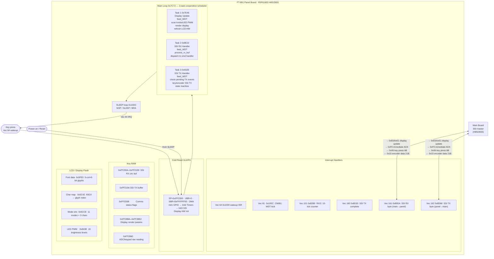

# FT-891 Panel Firmware Analysis
## AH065_P_V0101.bin — Panel Board MCU

**MCU**: Renesas R5F61653RN50FPV (H8S/2655), 24-bit big-endian, H8S/2600 family  
**Binary**: 384 KB (0x60000 bytes), flat raw flash image, base address 0x000000  
**Code region**: 0x001000 – 0x00C636 (~46 KB used; remainder erased to 0xFF)  
**Toolchain**: `h8300-linux-gnu-objdump -b binary -m h8300s --adjust-vma=0`

---

## 1. Architecture Overview

The panel board uses the same MCU as the main board (H8S/2655) but runs a radically
simpler firmware — only ~145 unique functions versus 1254 on the main board. The panel
is a pure front-panel I/O and display slave:

- **Display driver**: Renders the front-panel LCD (character font, icons, meters)
- **Input scanner**: Reads keypad matrix and rotary encoders
- **Inter-board bridge**: Full-duplex SSI (synchronous serial) to/from main board
- **Power management**: SLEEP-mode idle; wakeup via dedicated IRQ (power button)

There is no radio DSP, no CAT protocol parser, and no frequency synthesis. All of that
lives on the main board.

---

## 2. Block Diagram



---

## 3. Memory Map

### 3.1 Flash Layout — Quick Reference

```
Offset      Content
──────────────────────────────────────────────────────────────
0x000000    Vector table: 256 × 4-byte entries, big-endian
            Reset (Vec 0)  = 0x0010F6
            Default stub   = 0x001000  (→ JMP @0x10F6)
            Vec 64         = 0x001004  (power-on / wakeup ISR)
            Vec 81         = 0x0010EC  (CMIB1: WDT kick)
            Vec 101        = 0x0082B0  (RXI2: tick counter)
            Vec 160        = 0x008D30  (SSI TX complete)
            Vec 161        = 0x0089DA  (SSI RX byte ready)
            Vec 162        = 0x008D68  (SSI TX next byte)
0x001000    Default handler: 5A 00 10 F6 (JMP @0x10F6)
0x001004    Vec 64 / wakeup handler
0x0010DC    SLEEP idle loop
0x0010F6    Cold reset & boot
0x001212    Init functions 1, 2, 3
0x007C72    Main loop (3 tasks)
0x008000+   Display task + ISR handlers
0x009000+   TX state machine, packet builder, encoder TX
0x00C637+   Erased (0xFF) through end of flash
```

### 3.2 Flash Detailed Address Map

```
Address         Size    Description
──────────────────────────────────────────────────────────────────
0x000000-0x0003FF  1 KB   Exception vector table (256 × 4-byte entries)
0x001000           4      Default IRQ stub: JMP @0x10F6 (→ cold reset)
0x001004           ~100   Vec 64 wakeup IRQ handler (keypad power-on)
0x0010DC           8      SLEEP idle loop (NOP/SLEEP/BRA)
0x0010EC           8      Vec 81 / CMIB1: WDT kick (writes 0xA500 to WDTCNT)
0x0010F6           ~0x115 Cold reset handler & boot sequence
0x001212                  Init function 1 — GPIO, port direction setup
0x001668                  Init function 2 — timer / clock configuration
0x001D84                  String: "MENU" (literal menu label)
0x001F56                  Filter BW table: 5k/10k/20k/50k/100k labels + values
0x005062                  display_param_load5() — load 5-byte display descriptor
0x005084                  display_param_load6() — load 6-byte display descriptor
0x005828                  display_render_dispatch() — select font renderer by type
0x005C42                  Character map table (ASCII → glyph index)
0x005CCE                  Mode name strings: "LSB","USB","CW ","UCW","LAM"," FM ","R-L","R-U","D-L","D-U"
0x005FE0                  Font bitmap data (5-column × 6-pixel glyphs, ~6 bytes each)
0x006000+                 Icon / bargraph bitmap sprites
0x007BB4                  Display hardware init (display power-on sequence)
0x007C72                  *** MAIN LOOP *** (3-task round-robin superloop)
0x007E46                  Task 1: display_update_handler
0x008222                  ADC / keypad hardware init
0x008960                  Init function 3 — SSI serial comm setup
0x0082B0                  Vec 101 / RXI2 ISR — periodic tick (10-count)
0x008D30                  Vec 160 / SSI TX-complete ISR
0x008D68                  Vec 162 / SSI TX-byte-ready ISR (feeds next byte to SSITDR)
0x0089DA                  Vec 161 / SSI RX ISR (receives byte from main board)
0x008E00                  Generic 4-byte jump-table dispatcher (shared utility)
0x008E22                  Task 2: inter_board_rx_handler
0x008960                  SSI comm init (sets RX/TX buffer base pointers)
0x00932E                  Task 3: button_encoder_tx_handler
0x009346                  TX command dispatcher (checks 0xFF2D58 flags)
0x009486                  Full encoder/display-state TX state machine
0x00967E                  ssi_write_byte() — direct SSI byte write
0x00968E                  build_tx_packet() — assemble panel→main SSI packet
0x0096BA                  arm_ssi_tx() — reset TX pointer and enable SSI TX interrupt
0x0096D4                  ssi_tx_state_machine() — timing/retry management
0x00971E                  Contains: "AH065H" (firmware model string)
0x00C636                  Last non-FF byte; end of code/data region
```

### 3.3 Internal RAM Variables

```
── Internal RAM (H8S/2655) ──────────────────────────────────────
0xFF2000         1       Tick counter / initialization state flag
0xFF2002         4       SSI RX buffer read pointer (initialized to 0xFF200A)
0xFF2006         4       SSI RX buffer write pointer
0xFF200A-0xFF2199        SSI RX circular buffer (~400 bytes, main → panel packets)
0xFF219A         1       SSI TX buffer start (first byte = command type)
0xFF21AE         1       SSI TX packet total length
0xFF21AF         1       SSI TX current read pointer (byte offset into TX buffer)
0xFF21B0         1       Last received command byte
0xFF24E6-0xFF24E7        Encoder current state (word)
0xFF24EE         1       TX state / mode selector
0xFF24EF         1       RX timeout counter
0xFF24F0         1       Display refresh timer (ticks)
0xFF24F1         1       Retry countdown
0xFF24F2         1       Command retry depth counter
0xFF24F4         1       TX attempt counter (init to 3)
0xFF28BA         1       Display X position / column param
0xFF28BD         1       Display Y position / row param
0xFF28BE-0xFF28BF        Display width/height params
0xFF28C0         1       Display color/attribute param
0xFF28E2         1       Current font column count (6, 8, or 9)
0xFF2960         1       Current ADC/keypad raw reading
0xFF295F         1       Previous ADC keypad raw reading
0xFF2D1D         1       Timer decrement reference constant
0xFF2D1E-0xFF2D1F        Display blink counter (word)
0xFF2D23         1       Previous knob 1 position
0xFF2D24         1       Previous knob 2 position
0xFF2D38-0xFF2D41        Encoder state snapshot (multi-byte)
0xFF2D56         1       Display-updated flags (bits 4-7)
0xFF2D57         1       Display-ready flags (bits 0, 7)
0xFF2D58         1       SSI comms status flags (see bit table below)
0xFF2D59         1       Display rendering state flags
0xFF2D5A         1       Display blink / cursor mode flags
0xFFFBA6                 LCD parallel port control
0xFFFFB0-0xFFFFB7        Keypad/LED PWM control registers
0xFFFF34         1       Boot complete flag
0xFFFF36         1       Wakeup-recovery flag
0xFFFF40         1       Keypad wakeup status register
0xFFFF51         1       Some peripheral enable
0xFFFF68         1       PWM blanking register
0xFFFDC2-0xFFFDC6        DMA controller init (same as main board)
0xFFFE90         1       SSPCR0 — SSI frame size (set to 0x08 = 8-bit)
0xFFFE91         1       SSPCR1 — SSI clock prescaler (set to 0x05)
0xFFFE92         1       SSISR  — SSI control/enable (0x70 = RX+TX enable)
0xFFFE93         1       SSITDR — SSI transmit data register
0xFFFE94         1       SSISR2 — SSI status (bit 6 = RX ready, bit 7 = TX empty)
0xFFFE95         1       SSIRDR — SSI receive data register
0xFFFE96         1       SSICR  — SSI clock config (set to 0xF2)
0xFFFFA4         2       WDTCNT — watchdog timer counter
```

**0xFF2D58 Comms Status Flags**

| Bit | Meaning |
|-----|---------|
| 0   | Main→panel RX new data flag |
| 1   | Main→panel RX pending (inhibit normal processing) |
| 3   | TX packet in-flight (skip encoder/button check) |
| 4   | Encoder-change pending (queue encoder state TX) |
| 5   | Button-press pending (queue key event TX) |
| 6   | Display-update ACK request pending |
| 7   | SSI TX active (byte-by-byte ISR feeding in progress) |

---

## 4. Startup / Boot Sequence

```
Power-on → Vec 0 → 0x10F6 (Cold Reset)
│
├── Set SP  = 0xFFC000 (top of internal RAM)
├── CCR     = 0x80     (disable all interrupts)
├── EXR     = 0x7F     (mask all external IRQs)
├── VBR     = 0x000000 (vector table at flash base)
├── SBR     = 0xFFFFFF00 (SFR base for 32-bit addressing)
│
├── DMA init: @0xFFFDC2=0xD103, @0xFFFDC4=0x0010, @0xFFFDC6=0xC8
│             (same 3-register sequence as main board)
│
├── Write 0x20 → @0xFFFF32 (I/O port direction/mode)
│
├── JSR 0x1212  (Init 1: GPIO directions, port states)
├── JSR 0x1668  (Init 2: timer setup, clock configuration)
├── JSR 0x8960  (Init 3: SSI comm init — sets buffer pointers,
│                         configures SSPCR0/1/SSICR, enables SSI)
│
├── Check @0xFFFF36 bit 0 (wakeup-recovery flag)
│   ├── Set:   jump to 0x1028 (recovery path: reset display HW,
│   │          re-init keypad, call display reinit @ 0x5AD6)
│   └── Clear: full normal startup below
│
├── Clear @0xFFFF36 bit 0, set @0xFFFF34 bit 0 (boot complete)
├── Write 0x01 → @0xFF2000 (init tick state)
├── JSR 0x7BB4  (display power-on sequence + hardware init)
├── EXR = 0x78  (unmask: enable SSI + keypad interrupts)
├── JSR 0x8222  (ADC / keypad initial reading)
├── JSR 0x59EA  (additional peripheral setup)
├── Write 0x88 → @0xFF2960, @0xFF295F (ADC baseline)
│
└── Enter Main Loop @ 0x7C72
```

### SLEEP Mode & Wakeup (Vec 64 @ 0x1004)

When idle (no activity), the panel enters the SLEEP loop at 0x10DC:

```asm
10dc:  nop / nop / SLEEP / nop / nop / nop
10e8:  bra .-14 (0x10dc)    ; loop back
```

A key press asserts an external signal into Vec 64. The ISR at 0x1004:
1. Reads wakeup-status bits at 0xFFFF40
2. If spurious: bclr 0xFFFF36 bit 0 → RTE (stay asleep)
3. If genuine keypress:
   - Kick WDT (0xA500 → WDTCNT)
   - Reset keypad LED PWM regs (0xFFFFB4/B5/B6/B7 = 0)
   - Clear LCD parallel port bits 5/6/7 in 0xFFFBA6
   - Call 0x5AD6 (re-init display/keypad hardware)
   - Then fall through to full boot (JSR 0x1212, etc.)

---

## 5. Main Loop (Superloop at 0x7C72)

The panel runs a 3-task cooperative superloop — no RTOS:

```asm
7c72:  jsr @0x7e46     ; Task 1: display_update_handler
7c76:  jsr @0x8e22     ; Task 2: inter_board_rx_handler
7c7a:  jsr @0x932e     ; Task 3: button_encoder_tx_handler
7c7e:  bra .-14        ; loop forever
```

### Task 1 — display_update_handler (0x7E46)

```
7E46: jsr @0x83C6   → feed_watchdog() — writes 0x5A00 to @0xFFFFA4
      jsr @0x8310   → clear_display_flags() — bclr bits 4-7 of 0xFF2D56
      jsr @0x8236   → scan_knobs_leds() — check AF/SQL encoder positions, drive LED PWM
      jsr @0x8200   → read_adc() — poll ADC channels, update 0xFF2960
      btst #7, @0xFF2D57 → check "display data ready"
      if clear: return (nothing to show yet)
      jsr @0x7F28   → update_field_display() — render changed display fields
      btst #7, @0xFF2D56 → check "all fields rendered"
      if clear: return
      jsr @0x7E8C   → blink_handler() — manage cursor/blink timer
      jsr @0x8078   → refresh_lcd_hardware() — send framebuffer to LCD
      jsr @0x7EC8   → cursor_step_handler() — advance cursor if blink active
      jsr @0x7EF8   → scroll_or_input_handler() — handle text input scroll
      jsr @0x8132   → some_update() — additional display state
      jsr @0x81C8   → finalize_display() — commit framebuffer
```

The function `update_field_display` (0x7F28) is the primary LCD rendering entry point.
It reads display descriptors from the circular buffer and calls the font renderer chain:
`display_render_dispatch() → display_param_load5/6() → [per-font-width renderer]`

#### Supply-voltage measurement (panel-local — not sent to main board)

`read_adc()` (0x8200 → 0x8222 → 0x8240) samples **panel ADC channel 0 (0xFFFF90)** via the convert
primitive at 0x825E (write ADCSR 0xFFFFA0, start, poll busy bit 7). The reading is running-averaged
(`(old+new)/2`, 0x8298) into **0xFF2D28**. A separate consumer at 0x94E4 slew-limits it (±4/step,
clamped) into a smoothed value **0xFF24E8**, and 0x9650 → 0x968E packs that into an LCD display
descriptor (buffer 0xFF219A, length 0xFF21AE).

This is the **external DC supply voltage** shown briefly on the LCD at power-up. It is measured and
displayed entirely within the panel MCU and is **never transmitted to the main board** over SSI — the
panel→main packets carry only key (0x06) and encoder (0x15) events. That is why the input voltage is
visible only during the panel's own boot, before the main board takes over the display. Consequently
**no main-board CAT command can return the supply voltage** without a firmware change on both MCUs
(panel: add it to a panel→main packet; main: receive it and add/repurpose a CAT handler such as an
`RM` index). See `MAIN_FIRMWARE_ANALYSIS.md` → "ADC Metering" for the main-board side (all six main
ADC channels are RF/audio meters; none is the supply voltage).

### Task 2 — inter_board_rx_handler (0x8E22)

```
8E22: jsr @0x83C6   → feed_watchdog()
      jsr @0x8E30   → process_rx_buffer()
      jsr @0x9300   → update_rx_timeout()
```

`process_rx_buffer()` (0x8E30):
- Checks 0xFF2D58 bits 1 and 0 (inhibit flags)
- Enables IRQs (EXR=0x7F), reads write ptr @0xFF2006
- Compares with read ptr @0xFF2002
- If data available: reads next length-prefixed message from ring buffer @0xFF200A (wraps at 0xFF219A →
  0xFF200A) into 0xFF2345, then dispatches on the first byte (message **tag**) at 0x8F1C

**Message tags** (main → panel):

| Tag | Handler | Purpose |
|-----|---------|---------|
| 0x20 / 0x40 / 0x42 / 0x43 / 0x72 / 0x74 / 0x76 | 0x90DA / 0x9144 / 0x920E / 0x9102 / 0x9186 / 0x924C / 0x8FF0 | display field / state updates into 0xFF295B |
| 0x21 | 0x91C4 | (encoder/aux) |
| 0x71 | 0x8FC0 | secondary state (version etc.) |
| **0x70** | **0x8F3A** | **full display + spectrum-scope state** (~380 bytes) |

**Spectrum-scope message (tag 0x70).** The 0x70 handler (0x8F3A) scatters the payload into four buffers
via the block-copy at 0x7E3A: 0xFF295B (182 B, general display), 0xFF28EA (11 B), 0xFF28F5 (2 B), and
**0xFF2B8F (184 B = scope block)**. Scope block layout: byte 0 = mode (`0xFF8D04 & 3` on the main side);
bytes 1–14 = marker + three frequency/edge fields; **bytes 15…165 = 151 trace levels** (0x00–0xF9;
0xFA = blank); tail = `"SPN"`/`"SWP"`/`"LV"` label descriptors.

**Scope renderer (0x43B0).** Reads the mode byte `0xFF2B8F[0]`, then the 151 column levels from
**0xFF2B9E** (= block offset 15). Each level is scaled to a bar height (piecewise map at 0x4400:
thresholds 0x32/0x33/0x96, ÷8) and drawn as a vertical bar into the LCD framebuffer at **0xFF259A**
using the pixel-pattern lookup at **0xACCE** (framebuffer rows at +0xA0 / +0x140 / +0x1E0). Level 0xFA
renders as blank/baseline. See `MAIN_FIRMWARE_ANALYSIS.md` → "Spectrum Scope" for the producing side
(sweep engine, ring buffer 0xFF8A59, and the full 0x70 message table).

### Task 3 — button_encoder_tx_handler (0x932E)

```
932E: jsr @0x83C6   → feed_watchdog()
      btst #3, @0xFF2D58 → TX packet in-flight?
      if set: return (SSI busy, skip)
      jsr @0x936A   → check_pending_tx_events()
      jsr @0x96D4   → ssi_tx_state_machine()
```

`check_pending_tx_events()` (0x936A):
- Bit 5 of 0xFF2D58 set → button pressed: call 0x944A → sends 6-byte key event via SSI
- Bit 4 of 0xFF2D58 set → encoder moved: call 0x9468 → sends 21-byte encoder state via SSI
- Otherwise: check display update ACK, manage display timeout

`ssi_tx_state_machine()` (0x96D4): timer-based retry handler for SSI TX operations.

---

## 6. Key Utility Functions

| Address  | Call Count | Name / Role |
|----------|-----------|-------------|
| 0x83C6   | 3×        | feed_watchdog() — writes 0x5A00 to WDTCNT; called at start of every task |
| 0x8E00   | ?         | jump_table_dispatch() — generic 4-byte vtable indexed by R0 |
| 0x5062   | 44×       | display_param_load5() — load 5-byte display descriptor from ER5 into RAM |
| 0x5084   | 52×       | display_param_load6() — load 6-byte display descriptor from ER5 into RAM |
| 0x5828   | 40×       | display_render_dispatch() — selects one of 5 font rendering paths |
| 0x7E3A   | 28×       | memcpy_byte() — copies R0H bytes from ER1 to ER2; used throughout display code for sprite/bitmap blitting |
| 0x5AD6   | 22×       | display_hw_write() — writes byte to LCD controller hardware |
| 0x3262   | 17×       | draw_meter_segments() — bargraph/meter renderer: loops over 6-byte segment descriptors; selects lit/unlit sprite (bit 7 of descriptor) from 5 sprite pairs at 0xB22E–0xB4C0 based on 0xFF28BF attribute; calls sprite renderer 0x5976 for each segment |
| 0x3326   | 17×       | decode_icon_widths() — pre-pass over 6-byte icon descriptors; extracts low-3-bit width field (clamped 1–5) into 0xFF28BE for each record; sets up width params before draw_meter_segments() |
| 0x5B88   | 14×       | display_row_update() — display segment or partial-row updater |
| 0x967E   | (TX)      | ssi_write_byte() — load byte to SSITDR, trigger SSI frame |
| 0x968E   | (TX)      | build_tx_packet() — assemble [cmd][payload][checksum] into TX buffer |
| 0x96BA   | (TX)      | arm_ssi_tx() — reset TX ptr, enable Vec 162 ISR |
| 0x96D4   | (TX)      | ssi_tx_state_machine() — timer-based TX retry management |

---

## 7. Interrupt Service Routines

### Active Interrupt Vectors

| Vec | Addr   | ISR Addr  | Function |
|-----|--------|-----------|----------|
|   0 | 0x0000 | 0x0010F6  | Cold reset / power-on |
|  64 | 0x0100 | 0x001004  | Wakeup IRQ (power button / keypad) |
|  81 | 0x0144 | 0x0010EC  | CMIB1: WDT kick (0xA500 → 0xFFFFA4) |
| 101 | 0x0194 | 0x0082B0  | RXI2: periodic 10-count tick |
| 160 | 0x0280 | 0x008D30  | SSI TX complete (clears status bits) |
| 161 | 0x0284 | 0x0089DA  | SSI RX byte ready (main→panel data) |
| 162 | 0x0288 | 0x008D68  | SSI TX byte request (panel→main data) |

All other 249 vectors → 0x001000 (JMP @0x10F6 = soft reset).

### Vec 81 — WDT Kick (0x10EC)

```asm
10ec:  mov.w  #0xa500,r0
10f0:  mov.w  r0,@0xffffa4  ; WDTCNT ← 0xA500 (keep-alive)
10f4:  [fall-through to cold reset @ 0x10F6]
```

Fires periodically (CMIB1 = Compare Match B of Timer 1). The fall-through to 0x10F6
does NOT restart the system; the first instruction at 0x10F6 is `mov.l #0xffc000,er7`
which is safe to re-execute (SP reset is harmless if the main loop is already
running and this ISR actually returns via the BRA in the SLEEP loop tail).

### Vec 101 — RXI2 Periodic Tick (0x82B0)

```
82B0: Increment @0xFF2D1C (tick counter)
      Decrement @0xFF2000 (init state counter)
      If counter reaches 0: reset to 10; check @0xFF2D57 bit 0
        If set: call 0x7A7C + 0x7C18 (refresh display counters)
      bclr #0 @0xFFFFF5 (clear RXI2 interrupt flag)
```

Appears to fire approximately every 10 I/O ticks for periodic housekeeping.

### Vec 161 — SSI RX (0x89DA) — main board → panel

```
89DA: push ER0-ER3
      read SSIRDR (0xFFFE95) → R3L (received byte)
      bclr #6, @0xFFFE94    clear RX-ready flag
      @0xFF24EF ← 10        reset RX timeout counter
      read @0xFF24EE          current RX state/byte-count
      jsr @0x8E00             jump-table dispatch on byte count
      [pop, RTE]
```

0x8E00 is a generic dispatcher:  
`index × 4 + table_ptr → function_ptr → JMP @er1`

This delivers each received byte to the appropriate position-handler in the receive
state machine (byte 0 = command, bytes 1..N = payload).

### Vec 160 — SSI TX Complete (0x8D30)

```
8D30: bclr #5, @0xFFFE94   clear TX bit 5
      bclr #4, @0xFFFE94   clear TX bit 4
      bclr #3, @0xFFFE94   clear TX bit 3
      btst #6, @0xFFFE94   check if RX also ready (full-duplex coincidence)
      if set: read SSIRDR → R0L; bclr #6, @0xFFFE94
      RTE
```

Fires when SSI completes a full frame. Clears TX status bits.

### Vec 162 — SSI TX Next Byte (0x8D68) — panel → main board

```
8D68: push ER0, ER1
      R1L ← @0xFF21AF       (TX read pointer)
      R0L ← @[0xFF219A + R1L]  (next byte from TX buffer)
      @0xFFFE93 ← R0L       (SSITDR: load TX shift register)
      bclr #7, @0xFFFE94    clear TDRE (trigger TX of this byte)
      R1L++; @0xFF21AF ← R1L  (advance pointer)
      if R1L == @0xFF21AE (end of packet):
        bclr #7, @0xFFFE92  disable SSI TX interrupt
        check first TX byte (@0xFF219A):
          0xE1: bset #7, @0xFF2D58 (new-data flag for display ack)
          0xF0: call 0x96BA (arm next TX packet)
          else: set retry timer
        bclr #3, @0xFF2D58  clear TX-in-flight flag
      pop, RTE
```

---

## 8. Display Subsystem

### LCD Architecture

The front-panel LCD is driven from a framebuffer in RAM. The rendering pipeline:

```
Main board sends display packet via SSI
     ↓
Vec 161 ISR receives bytes → circular RX buffer (0xFF200A)
     ↓
Task 2: process_rx_buffer() reads packet, dispatches to display handler
     ↓
Display update renders character/icon data into display RAM
     ↓
Task 1: refresh_lcd_hardware() sends framebuffer to LCD controller
```

### Font Rendering

Character bitmaps use a **5-column × 6-bit** format (one byte per column):

```
Character → char_map[@0x5C42 + ascii_code] → glyph_index
glyph_index × 6 → offset into font_bitmap[@0x5FE0]
```

ASCII 0x20 (space) maps to glyph 0 (6 zero bytes).
ASCII 0x21 onwards maps sequentially via the table at 0x5C42.

The `display_render_dispatch()` at 0x5828 selects one of 5 rendering paths:

| Entry | Base Address | Col Count | Use |
|-------|-------------|-----------|-----|
| 1     | 0x523A      | 6         | Standard 6-column font |
| 2     | 0x52EA      | 8         | Wide 8-column font |
| 3     | 0x5420      | 9         | Extra-wide 9-column font |
| 4     | 0x539A      | 8         | Alternate 8-column renderer |
| 5     | 0x557A      | 9         | Alternate 9-column renderer |

Display parameters are loaded into a scratch area at 0xFF28BA–0xFF28C0 before each call:
- 0xFF28BA: X position (column)
- 0xFF28BD: Y position / attribute
- 0xFF28BE: Width parameter
- 0xFF28BF: Height parameter
- 0xFF28C0: Color / display mode
- 0xFF28E2: Current column count (font width)

### Display Character Set (0x5C42)

The character map at 0x5C42 is an ASCII-sequential lookup: bytes 0x00–0x1F map to 0
(no glyph); byte 0x20 maps to glyph 1, 0x21 to glyph 2, etc. The printable character
set (extracted from 0x5C81) covers:
```
Space ! " # $ % & ' ( ) * + , - . / 0-9 : ; < = > ? @
A-Z [ \ ] ^ _ ` a-j
```

### Mode Display Strings (0x5CCE)

11 operating modes, 3 characters each, null-terminated:
```
"LSB" "USB" "CW " "UCW" "LAM" " FM" "R-L" "R-U" "D-L" "D-U" "   "
```
(UCW = CW-Reverse, LAM = Lower AM, R-L/R-U = RTTY-LSB/USB, D-L/D-U = Data LSB/USB)

### IF Filter Labels (0x1F56)

5 bandwidth options with 4-byte binary timer values:

```
Offset    Timer Value    Label
0x1F40    0x000124F8    "  5k"
0x1F44    0x0002DC6C    " 10k"
0x1F48    0x0005B8D8    " 20k"
0x1F4C    0x00FA01F4    " 50k"
0x1F50    0x03E809C4    "100k"
```

### Menu Strings (various offsets)

- 0x1D84:  "MENU"
- 0x85EF:  "YAESU" / "yaesu" (product name, encoded prefix)
- 0x8602:  Field codes for CLAR, NB, AGC, DGAIN
- 0x86BF:  Full menu tree: FST/MID/SLW DELAY (100ms/2460ms/3580ms), DISPLAY MYCALL
- 0x8789:  CW TEXT memory editor (5 × 10-char channels, PLAY buttons)
- 0x883A:  Editor controls: "DEL", "INS", " C/E "
- 0x88F5:  "METER SETTING" — meter options: PO, ALC, SWR, SLOW, COMP, IDD, BK-IN
- 0x971E:  "AH065H" (panel board firmware model string)

### Bitmap Icons (0x9XXX)

Approximately 0x9700–0xC636 contains packed bitmap data for special display elements:
bargraph segments (SSS-meter), S-meter segments, and other icons. Pattern bytes like
`Auuu{`, `c]]]c`, `[UUUm` are column data for 5-pixel-wide sprites.

---

## 9. Inter-Board Communication Protocol (SSI)

### Physical Layer

The panel and main board share a full-duplex SSI (Synchronous Serial Interface).
The main board drives the clock; the panel is the slave. SSI configuration set during
init3 (0x8960):

```
SSPCR0 @0xFFFE90 = 0x08  (8-bit frame)
SSPCR1 @0xFFFE91 = 0x05  (clock prescaler)
SSISR  @0xFFFE92 = 0x70  (enable RX+TX)
SSICR  @0xFFFE96 = 0xF2  (clock polarity/phase)
```

### Main → Panel Packets (received in RX buffer @ 0xFF200A)

Packet format: `[cmd_byte] [payload...] [checksum]`

| Command Byte | Meaning |
|-------------|---------|
| 0xE0        | Display update packet (triggers display redraw after countdown) |
| 0xE1        | Display update + request ACK (sets bit 7 of 0xFF2D58) |
| 0xF0        | Immediate ACK request (triggers re-arming of TX via 0x96BA) |

When a complete packet is received (Vec 162 ISR detects end of packet):
- 0xE1 → set bit 7 of 0xFF2D58 (display-update ACK needed)
- 0xF0 → call `arm_ssi_tx()` immediately
- Otherwise → start retry counter

### Panel → Main Packets (sent from TX buffer @ 0xFF219A)

Packet assembly (`build_tx_packet()` @ 0x968E):
```
Input:  R0L = command byte, R0H = payload count, ER1 = payload pointer
Output: buffer @0xFF219A = [cmd][payload...][checksum]
        @0xFF21AE = total length (count + 2)
        @0xFF24F4 = 3 (retry counter)
```

Checksum = 8-bit sum of all payload bytes.

| Command | R0L Value | Meaning |
|---------|-----------|---------|
| Key event  | 0x06    | Button pressed (6-byte payload = key matrix state) |
| Encoder    | 0x15    | Encoder changed (21-byte payload = full encoder state) |

Packet TX is triggered by `arm_ssi_tx()` (0x96BA):
- Resets TX pointer (@0xFF21AF = 0)
- Sets bit 3 of 0xFF2D58 (TX in-flight)
- Sets bit 7 of 0xFFFE92 (enable SSITDR-empty interrupt → Vec 162)

Vec 162 ISR then feeds bytes one at a time into SSITDR until the packet is fully sent.

---

## 10. Input Handling

### Rotary Encoder Scan

Two rotary encoders are polled in Task 1's `scan_knobs_leds()`:
- Current readings live in 0xFF2D3A/0xFF2D38-41 (multi-byte encoder state)
- Previous readings stored at 0xFF2D23 (knob 1) and 0xFF2D24 (knob 2)
- ADC channel at 0xFF2960 carries raw keypad/encoder readings
- When encoder changes: bit 4 of 0xFF2D58 is set → Task 3 queues 21-byte encoder TX

The FFFFF0-area registers (0xFFFFB0-0xFFFFB7) control LED PWM brightness for the
AF, SQL, RF, NB controls. A lookup table at 0x843E maps 15 brightness levels:
```
0x00, 0x0A, 0x14, 0x28, 0x3C, 0x50, 0x64, 0x78, 0x8C, 0xA0, 0xB4, 0xC8, 0xDC, 0xF0, 0x00
```

### Keypad Matrix

The keypad is scanned by reading 0xFF2960 (ADC/mux output). Key changes are detected
by comparing with previous value (0xFF2D23/0xFF2D24). On change:
- Bit 5 of 0xFF2D58 is set
- Task 3 calls `check_pending_tx_events()` → path 0x944A → 6-byte key TX

---

## 11. Watchdog Timer

WDT is fed from two sources:

| Source | Value | Location |
|--------|-------|----------|
| Vec 81 ISR (CMIB1 periodic) | 0xA500 → @0xFFFFA4 | 0x10EC |
| feed_watchdog() (called from every task) | 0x5A00 → @0xFFFFA4 | 0x83C6 |

`feed_watchdog()` at 0x83C6 is called at the start of all three main loop tasks,
ensuring the WDT is serviced multiple times per superloop cycle.

---

## 12. Comparison with Main Board

| Aspect | Main Board (AH065_M) | Panel Board (AH065_P) |
|--------|---------------------|----------------------|
| Code size | ~375 KB (nearly full flash) | ~46 KB |
| Functions | ~1254 unique | ~145 unique |
| Main loop tasks | 16 tasks | 3 tasks |
| Active ISRs | 20 vectors | 6 vectors |
| CAT parser | Yes (122 commands) | No |
| DSP / radio | Yes (ADC, filters, etc.) | No |
| Display driver | No (commands to panel) | Yes (full bitmap renderer) |
| Inter-board | SSI master (drives clock) | SSI slave |
| Readable strings | Many (menus, CW ID, etc.) | Moderate (menu labels, mode strings) |
| WDT feed | 0x5A00 + 0xA500 from ISR | 0x5A00 + 0xA500 from ISR (same) |
| SLEEP mode | No (superloop always runs) | Yes (panel idles in SLEEP) |

---

## 13. Toolchain / Disassembly Reference

```bash
# Full disassembly
h8300-linux-gnu-objdump -b binary -m h8300s --adjust-vma=0 -D \
    ~/ft891/FT-891_Firmware_Update_2022_12/AH065_P_V0101.bin > panel_disasm.txt

# Range disassembly
h8300-linux-gnu-objdump -b binary -m h8300s --adjust-vma=0 -D \
    --start-address=0xADDR --stop-address=0xBBBB \
    ~/ft891/FT-891_Firmware_Update_2022_12/AH065_P_V0101.bin

# Raw hex
xxd -s 0xOFFSET -l LENGTH ~/ft891/FT-891_Firmware_Update_2022_12/AH065_P_V0101.bin
```

**Ghidra 12.1.2**: Works with the patched H8S SLEIGH spec (same as main board).
Install `carllom/sleigh-h8` into Ghidra then apply the H8S extensions (BSET/BCLR/BTST
@addr:32 and SHLL/SHAR/SHLR/SHAL #2) to `/opt/ghidra_12.1.2_PUBLIC/Ghidra/Processors/H8/data/languages/h8300h.slaspec`.

```bash
analyzeHeadless <proj> ft891_panel \
  -import AH065_P_V0101.bin \
  -processor "H8:BE:32:H8300" -cspec default \
  -loader BinaryLoader -loader-blockname ROM -loader-baseaddress 0
```

Caveat: the `jump_table_dispatch()` at 0x8E00 (4-byte vtable, indirect JMP @ER1) confuses
auto-analysis — Ghidra reports an assertion error at 0x8E20 and misses many downstream
functions. Manually define function boundaries around 0x8E00 before running analysis to
improve coverage. Use `-noanalysis` + manual script for targeted decompilation.
